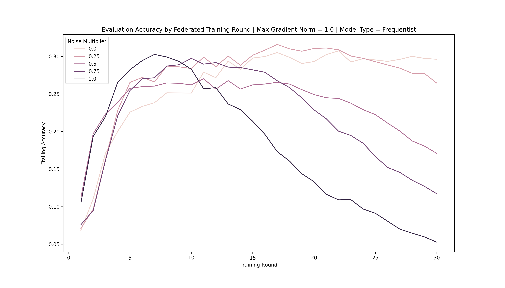
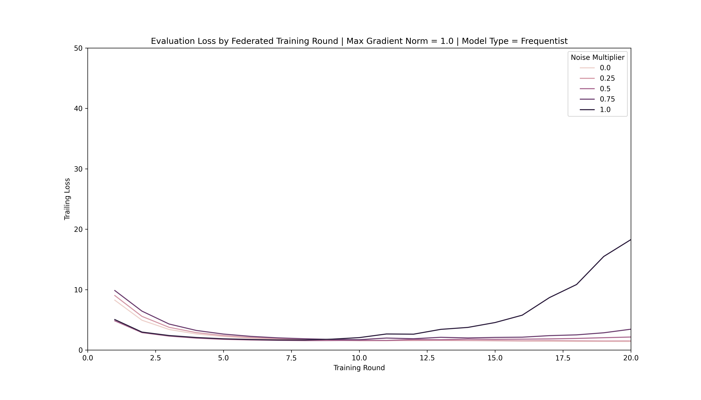
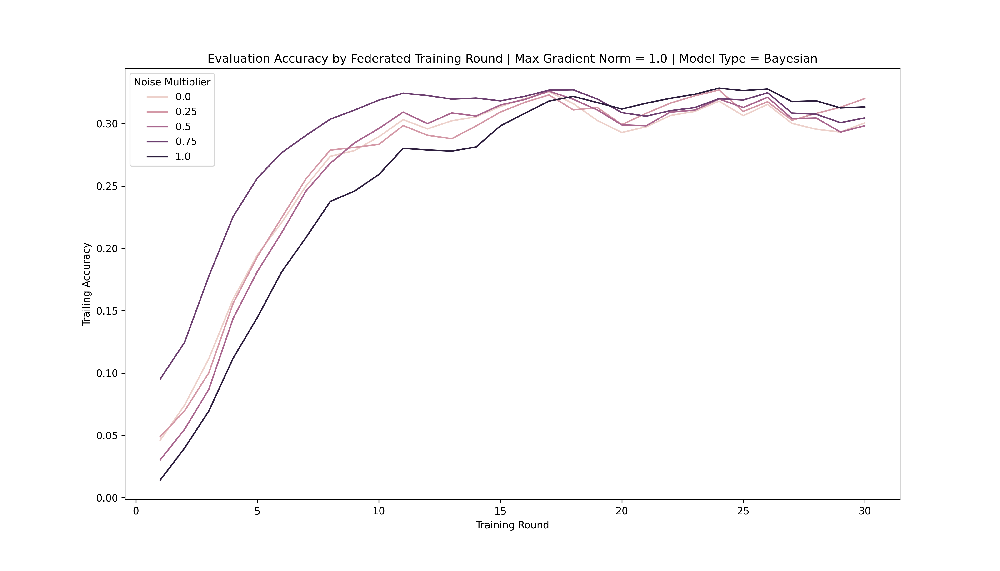
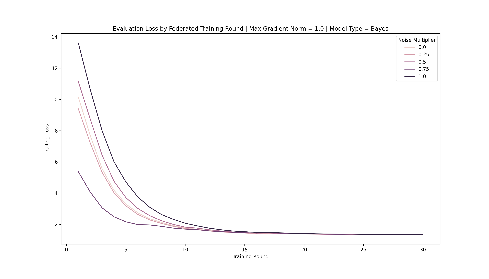
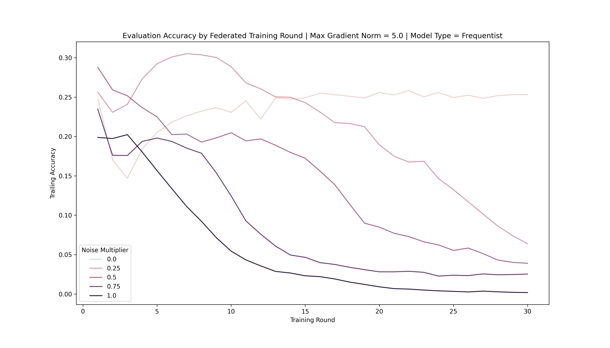
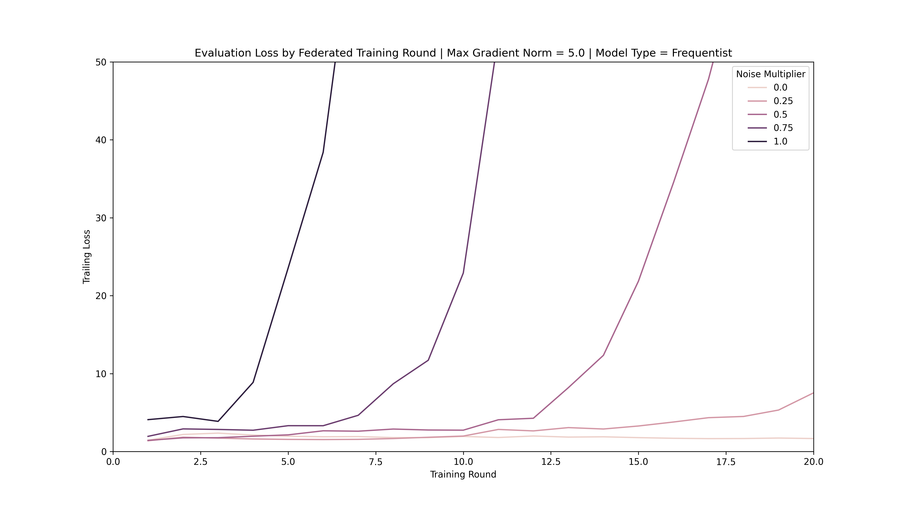
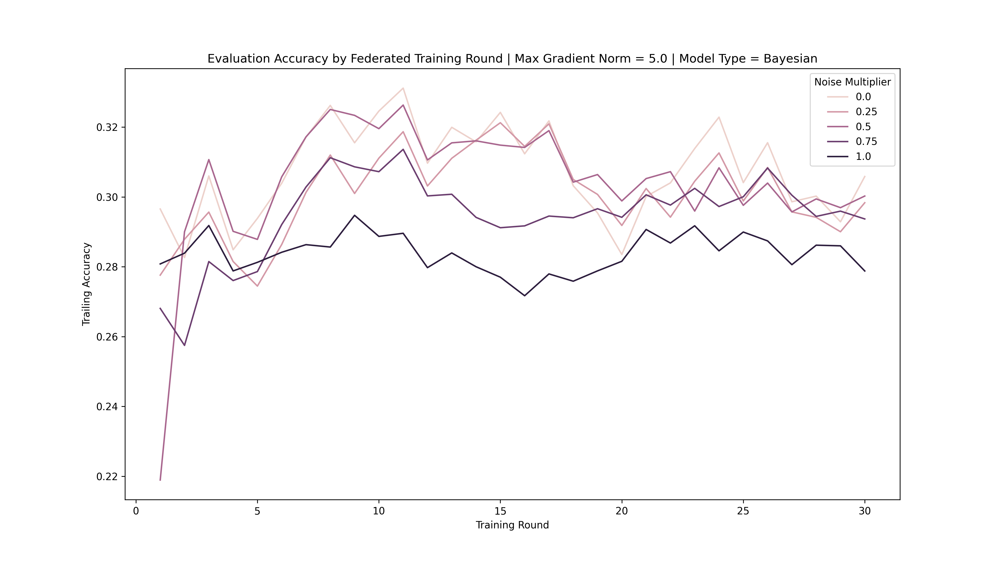
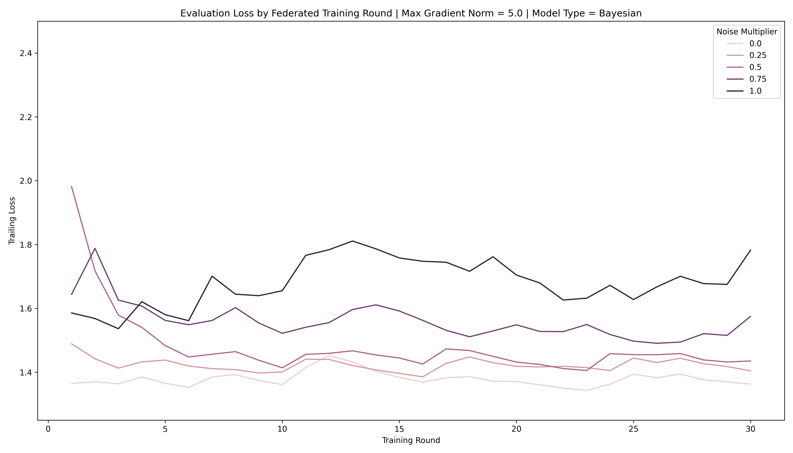

# Bayesian FedRec with Differential Privacy

# Team Members
Kevin Schattin (ks3936) 
Lynn Kim (ck3127)

# Description of the Project
A common approach to ensuring privacy during the training of federated recommendation systems is the use of differential privacy. Differential privacy aims to solve the problem of gradient leakage, in which private user data can be recovered by third-party attackers during the transmission of gradients from local models on user edge devices to a central server. Differential privacy works by modifying the local model gradients with noise before transmitting them to the central server, thereby disguising the gradients themselves, as well as the underlying data on which they are based. One particular pitfall of differential privacy is the fact that it generally leads to poorer model performance since the noisy gradients can produce weight updates that are not optimal.

Our goal is to eliminate the tradeoff between user privacy and model performance through the use of Bayesian Neural Networks. Our belief is that the inherent uncertainty in the parameters of a Bayesian Neural Network will serve to mitigate the unintended effects of model updates that are based on noisy gradients produced via differential privacy. We believe that a recommender system built using both Bayesian Neural Networks and differential privacy will not only be secure, but will also be accurate.

# Description of the Repository
The repository has the following structure: 

- .
  - data
    - u.data
    - u.item
    - u.user
  - docs
    - assets
    - setup.md
  - fed-baye
    - experiment-results
      - bayesian
      - frequentist
      - plots
    - infrastructure
      - __init__.py
      - client.py
      - metrics.py
      - server.py
    - models
      - __init__.py
      - bayesian.py
      - frequentist.py
    - plot_results.py
    - train.py
    - utils.py
    - __init__.py
  - __init__.py
  - .gitignore
  - README.md
  - requirements.txt


Starting at the top, the <b>data</b> directory contains the subsets of MovieLens100k relevant to our project. `u.data` contains rating data, `u.item` contains movie data, and `u.user` contains user demographic data. Next is the <b>docs</b> directory, which contains a `setup.md` file that describes how to set up a notebook environment on Google Cloud Platform for running the project.

The <b>fed-baye</b> directory contains the project's main code and has three sub-directories of its own. The <b>experiment-results</b> directory is for storing experiment results in CSV format. Depending on the type of model tested, results are either stored in <b>bayesian</b> or <b>frequentist</b>, and plots of these results are stored in <b>plots</b>.

The <b>infrastructure</b> directory contains the code for the Client and Server objects used in our experiments, and it also contains `metrics.py`, which itself contains the `RatingAccuracy` object used in the model evaluations in our experiments. The <b>models</b> directory contains the code responsible for constructing the models that are implemented via the Client and Server objects. While `frequentist.py` has a single function used to construct a recommender system with dense neural network-based sub-models, `bayesian.py` contains a similar function for building a Bayesian neural network-based recommender system, along with functions that define the prior and posterior distributions of the weights in those Bayesian neural networks.

`utils.py` contains utility functions for our project related to loading our centralized dataset and converting it into a set of user-specific subsets that can be used for simulation of the federated learning process. `train.py` is the main implementation script in our project, and it is responsible for loading the data, constructing the models, and conducting rounds of federated learning. This script has the following command-line arguments:

```
- bayesian: Boolean specifying whether the recommender system should have Bayesian (True) or Dense (False) layers
- layers: The number of layers to include in each block of the recommender system
- units: The number of units to include in each model layer
- clients: The number of clients to randomly select for training during each round of federated learning
- clip: The maximum L2 norm used for clipping large gradients during training
- noise-multiplier: A hyperparameter controlling the standard deviation of the noise distribution used to implement differential privacy
- rounds: The number of rounds of federated learning to conduct
- epochs: The number of epochs for which each client model should be trained during a round of federated learning
- batch-size: The batch size used for training client models
- learning-rate: The learning rate used for training client models
```

Lastly, `plot_results.py` takes experiment results that were stored in <b>experiment-results</b> by `train.py` and plots them. This script takes the following command-line arguments:

```
- bayesian: Boolean specifying whether to plot Bayesian neural network or dense neural network results
- clip: The gradient clipping norm used in the experiment for which results should be plotted
- metric: Whether to plot Loss or Accuracy results
- y-min: Minimum y-axis value for the plot
- y-max: Maximum y-axis value for the plot
- smoothed: Whether to plot raw results or results that have been smoothed using an exponentially weighted moving average and a lookback window of 3 rounds of federated learning
```

# Example Commands to execute the code 

Simulating the federated learning process is fairly straightforward. For example, to test a federated learning architecture trained for 20 rounds and with 20 clients, 3-layer sub-models with 64 units per layer, Bayesian layers, and a noise multiplier of 0.50, the command would be

`python3 train.py --bayesian True --clients 20 --layers 3 --units 64 --noise-multiplier 0.50 --rounds 20`

To then view the results of this run on a graph, the user should run `python3 plot_results.py --bayesian True` to plot the loss values across the 20 rounds and `python3 plot_results.py --bayesian True --metric Accuracy` to plot the accuracy values across the 20 rounds. 

# Results 

Our goal in this project was to demonstrate that the use of Bayesian neural network-based sub-models in federated recommender systems could effectively combat the model degradation effects of differential privacy. We believed that since Bayesian neural networks tend to be quite robust to noise and since their weights can be parameterized by distributions, noisy updates would prove less harmful to the models performance. To that end, we tested a number of different gradient and noise settings to find a better understanding of how these sorts of networks would behave in a noisy, federated environment. We did this while holding constant the number of clients per round to 10, the number of training rounds to 30, the client learning rate to 0.1, the number of client epochs to 1, the client batch size to 5, the number of additional layers in each sub-model block to 1, and the number of hidden units per layer to 8. In all, our models had anywhere from about 15,000 trainable parameters to about 20,000 trainable parameters.

We started off by comparing dense neural network-based recommender systems to Bayesian neural network-based recommender systems in which the maximum L2 norm used for gradient clipping was set to 1.0. Gradient clipping was performed prior to the addition of noise to the gradients, so this clipping value originally produced smaller, less volatile gradients. After clipping, noise was added to the gradients via random samples from a normal distribution. The means for these distributions was set to 0, and the standard deviations were determined by the gradient clipping value multiplied by the noise multiplier hyperparameter. We tested five different noise multipliers - 0.0, 0.25, 0.50, 0.75, and 1.0 - which meant that for this set of experiments, our noise distributions had standard deviations of 0.0, 0.25, 0.50, 0.75, 1.0. 

The evaluation accuracies and losses for the dense neural networks trained as part of these experiments demonstrate that this model configuration can really only tolerate noisy gradients up until a certain point. Each increase in the noise multiplier resulted in a noticeable decrease in the model's rating accuracy after about 10 or 15 rounds of federated learning. In a similar way, these models' loss values also started to increase again around the same time. Overall, these models could really only tolerate a noise multiplier of 0.25, with accuracy's being nearly cut in half after the noise multiplier was bumped up to 0.50.





On the other hand, the Bayesian neural network-based systems had no such trouble with wider noise distributions. Despite successive bumps in the width of the noise distribution, the systems demonstrate no difficulty in adapting to the extra noise. At no point during the 30 rounds of training did model quality drop off. Accuracy did plateau after a number of rounds, but it never dropped, as was the case with the dense neural network-based systems. The same was true of the loss; it plateaued, too, but it also never increased. We took this to mean that our idea that these networks would have an easier time adapting to gradient noise proved true. It also suggests that Bayesian neural network-based recommender systems can achieve greater degrees of privacy than their dense neural network counterparts.





To further confirm this, we increased the maximum L2 gradient norm to 5.0, while holding all other parameters constant. Not only did this allow for generally larger gradients, but it also increased the standard deviations for the noise distributions to 0.0, 1.25, 2.50, 3.75, and 5.00 across the five noise multiplier values under consideration. In the case of the dense neural network-based systems, model quality decreased almost immediately after a few training rounds due to this extra noise. Evaluation accuracy basically peaked after the first few epochs, and the additional noised produced in successive epochs drove the accuracy further and further down. In a similar manner, the loss values truly exploded after only a couple epochs, making it obvious that the models' training processes had diverged.





The Bayesian neural network-based systems fared far better in these noisier conditions. While the additional noise did make the evaluation accuracies and losses a bit more volatile, it was never the case that the accuracy plummeted or the loss exploded. Again, these networks proved to outperform their dense counterparts, lending further evidence to the idea that Bayesian neural networks designed to handle epistemic uncertainty are extremely well suited for federated learning that employs differential privacy. The tradeoffs that normally crop up with the use of differential privacy all but vanish here thanks to these networks' robustness to noise and ability to handle internal uncertainty. Future work might consider further exploration into and quantification of the additional privacy that could be provided by Bayesian neural network-based recommender systems.




